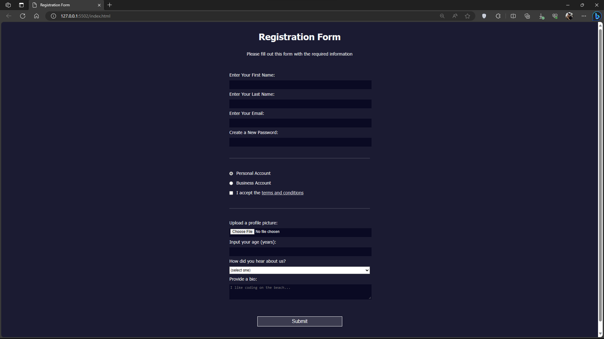
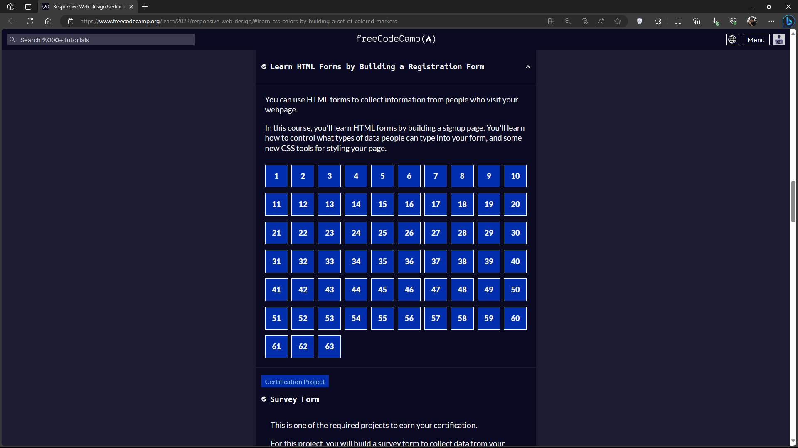

# Registration Form
The purpose of this repo is to monitor my progress in learning HTML and CSS by making Registration Form. I am utilizing the freeCodeCamp [Learn HTML Forms by Building a Registration Form](https://www.freecodecamp.org/learn/2022/responsive-web-design/#learn-html-forms-by-building-a-registration-form) for this repo.

## Screenshots

## Learnings
1. Viewport Height
2. Adding Fieldset
3. Adding rem unit (root em)
4. Adding minlength, pattern attribute for the input
5. Adding min and max in the type="number" input
6. textarea element (same as input but for more text)
7. Adding horizontal line separation for each fieldset. border-bottom: 3px solid #3b3b4f;
8. Using pseudocode :last-of-type
9. Adjusting the sizes of input elements